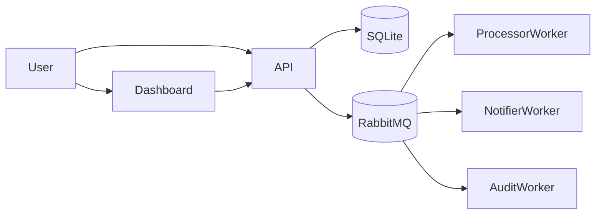

# OrderSystem

OrderSystem is a small distributed order-processing sample built with .NET 10.

It combines:

- a minimal ASP.NET Core API for creating and managing orders
- a layered application/domain/infrastructure design
- a Blazor WebAssembly dashboard for viewing orders and audit history
- RabbitMQ-based event publishing
- background workers that consume order events
- integration tests that exercise the API end to end
- Dockerfiles and Docker Compose definitions for local and production-oriented runs

## Table of contents

- [Overview](#overview)
- [Solution structure](#solution-structure)
- [Architecture](#architecture)
- [Domain model](#domain-model)
- [Order lifecycle](#order-lifecycle)
- [Event-driven flow](#event-driven-flow)
- [API reference](#api-reference)
- [Configuration](#configuration)
- [Running locally](#running-locally)
- [Running with Docker](#running-with-docker)
- [Testing](#testing)
- [Observability](#observability)
- [Health checks](#health-checks)
- [Notes and limitations](#notes-and-limitations)
- [License](#license)

## Overview

The system manages orders through a simple lifecycle:

1. Create an order
2. Start processing
3. Complete it

or:

4. Cancel it

When order state changes occur, domain events are raised and published through RabbitMQ routing keys. Separate worker services subscribe to those events to simulate downstream processing.

The solution uses SQLite for persistence and RabbitMQ for messaging.

## Solution structure

```text
OrderSystem
├── src
│   ├── OrderSystem.Api
│   ├── OrderSystem.Application
│   ├── OrderSystem.Dashboard
│   ├── OrderSystem.Domain
│   ├── OrderSystem.Infrastructure
│   └── OrderSystem.Workers
│       ├── OrderSystem.Worker.Audit
│       ├── OrderSystem.Worker.Notifier
│       └── OrderSystem.Worker.Processor
├── tests
│   └── OrderSystem.Tests
├── docker-compose.yml
├── docker-compose.override.yml
├── docker-compose.prod.yml
├── Directory.Build.props
└── OrderSystem.slnx
```

### Projects

| Project | Responsibility |
|---|---|
| `OrderSystem.Api` | Minimal API endpoints, health checks, exception mapping, startup, logging, and telemetry |
| `OrderSystem.Application` | Application services and abstractions such as `OrderService`, `IOrderRepository`, `IMessagePublisher`, and `IEventDispatcher` |
| `OrderSystem.Domain` | Core domain model including `Order`, `OrderStatus`, audit entries, domain events, and business rules |
| `OrderSystem.Infrastructure` | SQLite persistence, repository implementation, RabbitMQ publishing, and dependency registration |
| `OrderSystem.Dashboard` | Blazor WebAssembly UI for viewing orders and audit data |
| `OrderSystem.Worker.Processor` | Consumes `orders.created` events |
| `OrderSystem.Worker.Notifier` | Consumes `orders.completed` events |
| `OrderSystem.Worker.Audit` | Consumes all order events using `orders.*` |
| `OrderSystem.Tests` | Integration tests for the API using `WebApplicationFactory`, in-memory SQLite, and an in-memory published message collector |

## Architecture

The solution follows a layered structure:

- **Domain** contains business rules and domain events.
- **Application** coordinates use cases through services and interfaces.
- **Infrastructure** implements storage and messaging details.
- **API** exposes HTTP endpoints.
- **Workers** react to published domain events.
- **Dashboard** reads data from the API.



### Key technical choices

- **Runtime:** .NET 10
- **API style:** ASP.NET Core minimal APIs
- **Database:** SQLite
- **Messaging:** RabbitMQ topic exchange
- **UI:** Blazor WebAssembly
- **Logging:** Serilog
- **Telemetry:** OpenTelemetry tracing and metrics
- **Testing:** xUnit + Shouldly + ASP.NET Core integration testing

## Domain model

### Order aggregate

An order contains:

- `Id`
- `Customer`
- `Amount`
- `CreatedAt`
- `Status`
- `AuditLog`
- `DomainEvents`

### Order statuses

The domain supports these states:

- `Created`
- `Processing`
- `Completed`
- `Cancelled`

### Business rules

The domain enforces several state transition rules:

- A new order starts in `Created`.
- An order can only start processing if it is in `Created`.
- An order can only complete if it is in `Processing`.
- A completed order cannot be cancelled.

Each valid transition adds:

- an audit entry to the order aggregate
- a domain event to be published after persistence

## Order lifecycle

### Valid flows

#### Create only

```text
Created
```

#### Create -> Process -> Complete

```text
Created -> Processing -> Completed
```

#### Create -> Cancel

```text
Created -> Cancelled
```

#### Processing -> Cancel

```text
Processing -> Cancelled
```

### Invalid flows

Examples of invalid transitions:

- `Created -> Completed`
- `Completed -> Cancelled`
- `Cancelled -> Completed`

Invalid transitions are returned as HTTP `409 Conflict` responses with problem details. Unknown order IDs are returned as HTTP `404 Not Found`.

## Event-driven flow

The infrastructure dispatches domain events after the database save succeeds through `ApplicationDbContext.SaveChangesAsync`.

### Domain events and routing keys

| Domain event | Routing key |
|---|---|
| `OrderCreated` | `orders.created` |
| `OrderProcessingStarted` | `orders.processing` |
| `OrderCompleted` | `orders.completed` |
| `OrderCancelled` | `orders.cancelled` |

### Exchange

The RabbitMQ publisher sends messages to the topic exchange:

- Exchange: `orders`

### Worker subscriptions

| Worker | Queue | Binding |
|---|---|---|
| `OrderSystem.Worker.Processor` | `orders.processor` | `orders.created` |
| `OrderSystem.Worker.Notifier` | `orders.notifier` | `orders.completed` |
| `OrderSystem.Worker.Audit` | `orders.audit` | `orders.*` |

### Important distinction

There are two different audit concepts in this solution:

1. **Order audit log stored in the database**  
   This is the `AuditLog` collection inside the `Order` aggregate and is returned by the API.
2. **Audit worker event output**  
   The audit worker subscribes to all RabbitMQ events and writes them to console and log output. It does not populate the order's database audit log.

## API reference

Base URL when running locally:

- `http://localhost:8080`

### `GET /`

Returns basic API status information.

**Example response**

```json
{
  "name": "OrderSystem API",
  "status": "Running"
}
```

### `GET /health`

Returns API health check status.

### `GET /orders`

Returns all orders.

**Example response**

```json
[
  {
	"id": "0195b6d4-61df-7a95-b0f9-7b6f91a77d8f",
	"customer": "Alice",
	"amount": 149.95,
	"status": "Created",
	"createdAt": "2026-03-20T10:15:00Z"
  }
]
```

### `GET /orders/{id}/audit`

Returns the stored audit entries for a single order.

**Example response**

```json
[
  {
	"timestamp": "2026-03-20T10:15:00Z",
	"message": "Order created for Alice with amount 149.95"
  }
]
```

If the order does not exist, the endpoint returns `404 Not Found`.

### `POST /orders`

Creates a new order.

**Request body**

```json
{
  "customer": "Alice",
  "amount": 149.95
}
```

**Example response**

- Status: `201 Created`

```json
{
  "id": "0195b6d4-61df-7a95-b0f9-7b6f91a77d8f"
}
```

The response also includes a `Location` header pointing to `/orders/{id}`.

### `POST /orders/{id}/start-processing`

Moves the order from `Created` to `Processing`.

**Example response**

```json
{
  "message": "Order processing started"
}
```

### `POST /orders/{id}/complete`

Moves the order from `Processing` to `Completed`.

**Example response**

```json
{
  "message": "Order completed"
}
```

### `POST /orders/{id}/cancel`

Cancels an order unless it has already been completed.

**Request body**

```json
{
  "reason": "Customer request"
}
```

**Example response**

```json
{
  "message": "Order cancelled"
}
```

### Error responses

The API maps domain and application exceptions to problem details responses.

#### Order not found

- Status: `404 Not Found`

```json
{
  "type": "about:blank",
  "title": "Order not found",
  "status": 404,
  "detail": "Order with id '...' was not found."
}
```

#### Invalid order state

- Status: `409 Conflict`

```json
{
  "type": "about:blank",
  "title": "Invalid order state",
  "status": 409,
  "detail": "Order must be Processing to complete."
}
```

## Configuration

### Default behavior

If no configuration is provided:

- SQLite defaults to `Data Source=orders.db`
- RabbitMQ host defaults to `localhost`
- RabbitMQ port defaults to the library default AMQP port

### Important configuration values

| Key | Purpose | Example |
|---|---|---|
| `ConnectionStrings__DefaultConnection` | SQLite connection string for the API | `Data Source=orders.db` |
| `RabbitMq__Host` | RabbitMQ hostname | `localhost` |
| `RabbitMq__Port` | RabbitMQ port | `5672` |
| `ASPNETCORE_URLS` | API binding URL | `http://+:8080` |
| `ASPNETCORE_ENVIRONMENT` | API environment name | `Development` |

### Logging

The API and workers use Serilog and write to:

- console output
- rolling file logs under `logs/`

### Telemetry

The API enables OpenTelemetry with:

- ASP.NET Core tracing
- HTTP client tracing
- SQL client tracing
- ASP.NET Core metrics
- runtime metrics
- console exporter

## Running locally

### Prerequisites

Install:

- .NET 10 SDK
- Docker Desktop, if you want the full stack through containers
- RabbitMQ, if you want to run the API and workers outside Docker

### Restore dependencies

```powershell
dotnet restore .\OrderSystem.slnx
```

### Build the solution

```powershell
dotnet build .\OrderSystem.slnx -c Debug
```

### Run the API

If RabbitMQ is running locally on the default port:

```powershell
dotnet run --project .\src\OrderSystem.Api\OrderSystem.Api.csproj
```

If you want to set explicit values:

```powershell
$env:RabbitMq__Host = "localhost"
$env:RabbitMq__Port = "5672"
$env:ConnectionStrings__DefaultConnection = "Data Source=orders.db"
dotnet run --project .\src\OrderSystem.Api\OrderSystem.Api.csproj
```

### Run the workers

Processor worker:

```powershell
$env:RabbitMq__Host = "localhost"
$env:RabbitMq__Port = "5672"
dotnet run --project .\src\OrderSystem.Workers\OrderSystem.Worker.Processor\OrderSystem.Worker.Processor.csproj
```

Notifier worker:

```powershell
$env:RabbitMq__Host = "localhost"
$env:RabbitMq__Port = "5672"
dotnet run --project .\src\OrderSystem.Workers\OrderSystem.Worker.Notifier\OrderSystem.Worker.Notifier.csproj
```

Audit worker:

```powershell
$env:RabbitMq__Host = "localhost"
$env:RabbitMq__Port = "5672"
dotnet run --project .\src\OrderSystem.Workers\OrderSystem.Worker.Audit\OrderSystem.Worker.Audit.csproj
```

### Run the dashboard

The dashboard is easiest to use through Docker because its `nginx` configuration proxies `/api/*` requests to the API container.

If you run the dashboard outside Docker, you may need equivalent proxying or same-origin hosting for `/api/*` requests.

## Running with Docker

The repository includes:

- `docker-compose.yml`
- `docker-compose.override.yml`
- `docker-compose.prod.yml`
- Dockerfiles for the API, dashboard, and all workers

### Start the development stack

```powershell
docker compose up --build
```

### Validate the compose configuration

```powershell
docker compose config
```

### Stop the development stack

```powershell
docker compose down
```

### Stop and remove volumes

```powershell
docker compose down --volumes
```

### Start the production-oriented stack

```powershell
docker compose -f .\docker-compose.prod.yml up -d
```

### Stop the production-oriented stack

```powershell
docker compose -f .\docker-compose.prod.yml down
```

### Default container endpoints

| Service | URL |
|---|---|
| Dashboard | `http://localhost:8081` |
| API | `http://localhost:8080` |
| RabbitMQ Management | `http://localhost:15672` |

### Docker persistence

The compose setup uses named volumes:

- `orders-data` for the SQLite database
- `rabbitmq-data` for RabbitMQ data

In containers, the API stores SQLite data at `/data/orders.db`.

For more Docker-specific details, see `README.Docker.md`.

## Testing

The test project is `tests/OrderSystem.Tests`.

### Test stack

The integration tests use:

- xUnit
- Shouldly
- `Microsoft.AspNetCore.Mvc.Testing`
- in-memory SQLite
- a custom in-memory published message collector

### Important testing behavior

The integration tests replace:

- the real database connection with an in-memory SQLite database
- the real message publisher with an in-memory collector

This keeps tests fast, isolated, and deterministic. The tests do not require RabbitMQ to be running.

### Covered scenarios

- creating an order
- cancelling an order
- starting processing and completing an order
- trying to operate on unknown orders
- invalid state transitions
- verifying published event types and routing keys

### Run tests

```powershell
dotnet test .\tests\OrderSystem.Tests\OrderSystem.Tests.csproj
```

For more test-specific details, see `tests/OrderSystem.Tests/README.md`.

## Observability

### Logging

The system uses Serilog for structured logging.

The API and workers log to:

- console output
- rolling file logs under `logs/`

### Tracing and metrics

The API emits OpenTelemetry traces and metrics to the console.

Enabled instrumentation includes:

- ASP.NET Core
- outgoing HTTP requests
- SQL client
- runtime metrics

### Worker output

The workers print simple operational messages such as:

- processor receiving created events
- notifier sending completion notifications
- audit worker printing all order event payloads

## Health checks

### API

- `GET /health`

### Dashboard container

- `GET /healthz`

### Root status endpoint

- `GET /`

## Notes and limitations

- The API uses SQLite, which is well suited for local development and demos but is not always the best fit for high-concurrency production workloads.
- The dashboard fetches data from `/api/orders` and `/api/orders/{id}/audit`.
- The dashboard container uses `nginx` to proxy `/api/*` requests to the API service.
- The worker services currently simulate downstream behavior by consuming events and writing output rather than updating the API database.
- The stored order audit log comes from domain actions in the `Order` aggregate, not from the audit worker.
- GitHub workflow files are not currently present in the repository.

## License

This project is licensed under the MIT License.

See `LICENSE` for details.

